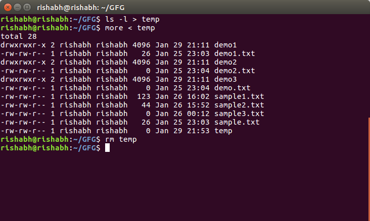

A pipe is a form of redirection (transfer of standard output to some other destination) that is used in Linux and other Unix-like operating systems to send the output of one command/program/process to another command/program/process for further processing. The Unix/Linux systems allow stdout of a command to be connected to stdin of another command. You can make it do so by using the pipe character **‘|’**.

```
command_1 | command_2 | command_3 | .... | command_N
```

Pipe is used to combine two or more command and in this the output of one command act as input to another command and this command output may act as input to next command and so on. It can also be visualized as a temporary connection between two or more commands/ programs/ processes. The command line programs that do the further processing are referred to as filters. This direct connection between commands/ programs/ processes allows them to operate simultaneously and permits data to be transferred between them continuously rather than having to pass it through temporary text files or through the display screen. Pipes are unidirectional **i.e data flow from left to right through the pipeline.** **Example :** **1\. Listing all files and directories and give it as input to more command.**

```
$ ls -l | more
```

**Output :**  [](https://cdncontribute.geeksforgeeks.org/wp-content/uploads/pipe-1.png) The more command takes output of $ ls -l as its input. The net effect of this command is that the output of ls -l is displayed one screen at a time. The pipe act as a container which take output of ls -l and giving it to more as input. This command does not use a disk to connect standard output of ls -l to standard input of more because pipe is implemented in the main memory. In terms of I/O redirection operators, the above command is equivalent to the following command sequence.

```
$ ls -l -> temp

more -> temp (or more temp)

[contents of temp]

rm temp


```

**Output :**  [](https://cdncontribute.geeksforgeeks.org/wp-content/uploads/pipe-1b.png) Output of above two commands are same.
