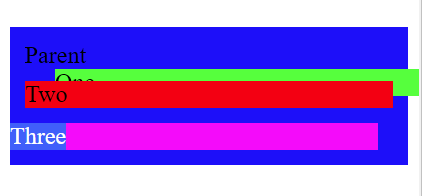

https://codepen.io/kevinpowell/pen/MQYGwY

Let's have a look at those advanced CSS selectors that can help you select your target:

## \* Universal

This select EVERYTHING (except `:before` and `:after` :D), to select those you want use `*::before` and `*::after`.

This is useful when want to apply something to all of your items, like:

```
*, *::before, *::after{
box-sizing:border-box;
margin-top:0;
}
```

This is a common use of the \* wildcard, setting the `box-sizing` this way will help you a lot when building your page.

## \> Direct Children

This will select all the "direct" children of in item. No grandsons, only sons :D ! That is the main difference with the child selector that select all the children (even nested).

## \+ Adjacent Siblings

Select the items that got this property: "Right before me (at the same level) is there a `[selector css]`". An example will be more exhaustive:

```
<section class="adjacent-sibling">
  <div class="box"></div>
  <div class="box"></div>
  <a href="#"> Not a box </a>
  <div class="box"></div>
  <div class="box"></div>
</section>

//Style.css
.adjacent-sibling .box + .box {
   backgrounnd:red;
}
```


The first one div of class box don't have another element with class .box before him, and nether the third box. And that is why they are gray.

## ~ General Sibling

General sibling is like the Adjacent Sibling With the difference that the sibling must be before, not right before. If we use the same code as before look at the difference:

```
<section class="adjacent-sibling">
  <div class="box"></div>
  <div class="box"></div>
  <a href="#"> Not a box </a>
  <div class="box"></div>
  <div class="box"></div>
</section>

//Style.css
.adjacent-sibling .box ~ .box {
   backgrounnd:red;
}
```



As you can see, the first one does not have a sibling before that have the class box, but the third one does, even if is not right before.

## \[\] Attribute

With the attribute selector, you can select thing using their attributes:

```
[target]{
/*..some css*/
}

a[target]{
/*..some css*/
}

//This will select ONLY the items that has a target of "about.html" and not "about-us.html"
a[target="about.html"]{
/*..some css*/
}

//This will select all target that contains the word about
a[target|="about"]{
/*..some css*/
}

//This will select All target that start with the word about (about.html and about-us.html)
a[target|="about"]{
/*..some css*/
}

//Like the|= selector but more forgiving because the word dont need to end
a[target^="about"]{
/*..some css*/
}

//This will look for an attribute that ends with .html
a[target$=".html"]{
/*..some css*/
}
```

The first one will select all the items that have the attribute target, the second will select all the `a` items that also have an attribute target.  
You can use all kind of attribute (href, size, type... etc).  
Also, you can specify the value of the attribute that you want to select if you need more precision `a[target="about.html"]`.  
If you need less precision, you add | before = and it will look for a word that start with the passed value
